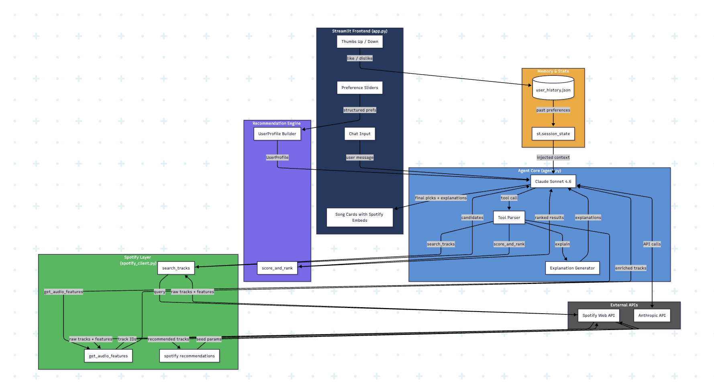

# Original Project - Music Recommener Stimulation

## Project Summary

This project is a rule-based music recommender simulation that suggests songs from a small 18-track catalog based on a user's preferred genre, mood, and energy level. Each song is scored using a weighted formula that rewards genre and mood matches and penalizes energy distance, then the top results are returned with plain-language explanations. It was built to explore how recommender systems turn structured data into ranked predictions, and to surface the tradeoffs and biases that emerge even in simple scoring logic.

---

# Agentic Music Recommender

## Summary

This project extends the original rule-based simulation into a fully agentic music recommender powered by Claude and the Spotify API. Users describe what they want to listen to in natural language, and a Claude agent iteratively searches Spotify, scores and ranks candidates using audio features, and returns personalized picks with explanations — all through a Streamlit chat interface. Unlike the original fixed pipeline, the agent decides how many searches to run and how to refine its query based on intermediate results, making the recommendation process dynamic and conversational.

# Architecture Overview



# Setup Instructions

### 1. Clone the repository

```bash
git clone https://github.com/doublehan2023/music-recommender-ai-agent.git
cd music-recommender-ai-agent
```

### 2. Create and activate a virtual environment

```bash
python -m venv .venv
source .venv/bin/activate        # Mac / Linux
.venv\Scripts\activate           # Windows
```

### 3. Install dependencies

```bash
pip install -r requirements.txt
```

### 4. Set up API keys

Create a `.env` file in the project root:

```
ANTHROPIC_API_KEY=your_anthropic_api_key
SPOTIFY_CLIENT_ID=your_spotify_client_id
SPOTIFY_CLIENT_SECRET=your_spotify_client_secret
```

- Get your Anthropic API key at [console.anthropic.com](https://console.anthropic.com)
- Get your Spotify credentials at [developer.spotify.com](https://developer.spotify.com/dashboard)

### 5. Run the original CLI simulation

```bash
python -m src.main
```

### 6. Run the Streamlit app

```bash
streamlit run app.py
```

### 7. Run tests

```bash
pytest
```

